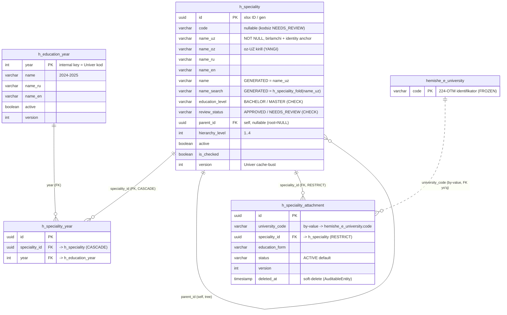

# Mutaxassislik klassifikatori — ER diagramma (V018 + V019)

> Yagona bakalavr+magistr mutaxassislik klassifikatori va unga tegishli jadvallar.
> Manba: `V018_create_h_speciality.sql`, `V019_create_h_speciality_attachment.sql`. Qaror: **ADR-0014**.

## Kalit constraint / xususiyatlar

| Jadval | Noyoblik / xususiyat |
|--------|----------------------|
| **h_speciality** | `uq_h_speciality_identity` **UNIQUE NULLS NOT DISTINCT (education_level, code, name_search)** — bir (edu,kod,nom) bitta yozuv. `name` va `name_search` — **GENERATED** ustunlar (yozib bo'lmaydi). Self-FK `parent_id` DEFERRABLE INITIALLY DEFERRED. |
| **h_speciality_year** | `uq_h_speciality_year (speciality_id, year)`. Bu + yuqoridagi identity → `(edu,kod,nom,yil)` noyob. |
| **h_speciality_attachment** | `uq_h_spec_attach (university_code, speciality_id, education_form) WHERE deleted_at IS NULL` — bir OTM'ga bir mutaxassislik bir marta (tirik). |
| **h_education_year** | `year` INT PK (Univer kodiga 1:1). Seed: legacy `hemishe_h_education_year`'dan + `generate_series(1991,2040)` fallback (legacy-mustaqil). |

## Funksiya
- **`h_speciality_fold(text)`** — IMMUTABLE (apostrof→probel, lower, whitespace-collapse). `name_search` generated ustunini quvvatlaydi; ETL `fold()` va Java `foldSearch()` bilan **bayt-ba-bayt** bir xil (identity kaliti bir xilligini kafolatlaydi).

## Izoh
- **`name_oz`** — yangi ustun (oz-UZ kirill), kushimcha manbasidagi asl kirill nomi. Nomlar per-til **ustunlar** modelida saqlanadi (tarjima-jadval EMAS) — sabab va rad etilgan variantlar: **[ADR-0014](../adr/0014-speciality-name-columns-and-identity.md)**.
- `hemishe_e_university` — eski CUBA jadvali (FROZEN); `university_code` orqali **by-value** bog'lanish (qattiq FK emas), 224 OTM identifikatori.
- Legenda: `||--o{` = bir-ko'p (qattiq FK); `||..o{` = bir-ko'p (by-value, FK yo'q); self-loop = ierarxiya daraxti (parent_id).

## Seed / ETL
- Manba: `domain/etl/speciality/` (`etl_speciality.py` → S014/S015; `etl_speciality_kushimcha_2026.py` → S017).
- S014: 5392 qator (28 identity-dup konsolidatsiya qilingan); S017: 65 kushimcha-2026 (`name_oz`=kirill).
