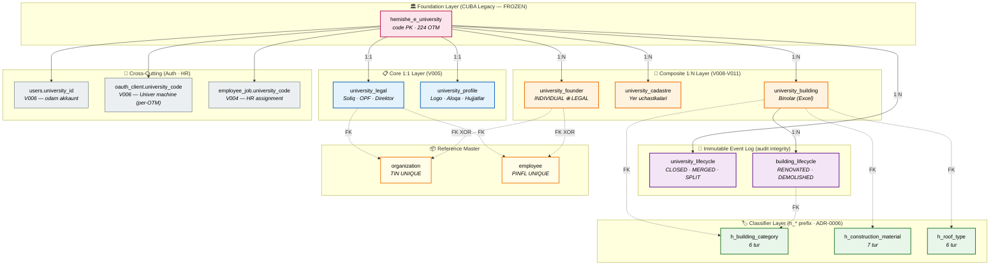
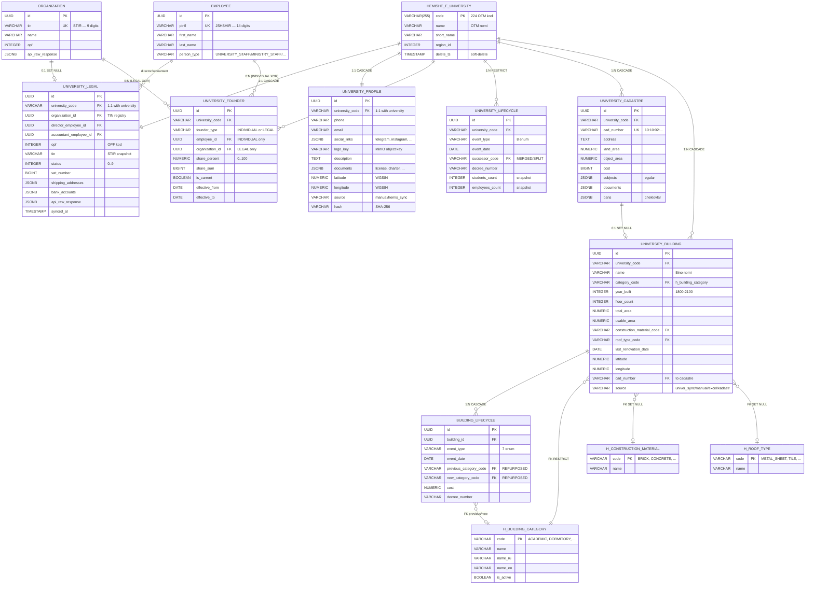
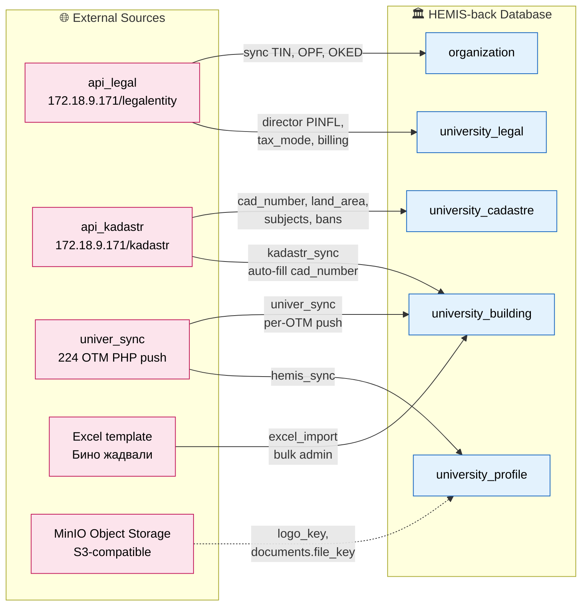
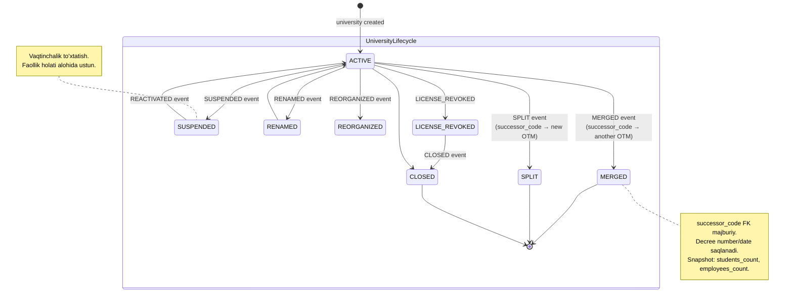
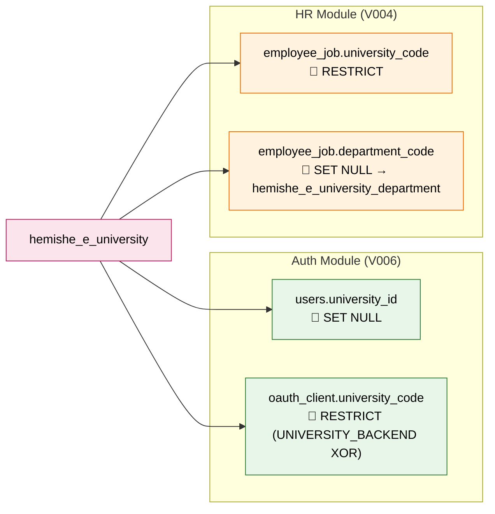

# University Domain — Entity Relationship Diagram

> **Hujjat maqsadi:** Project Manager / Team Lead tasdig'i uchun HEMIS-back loyihasidagi universitetga tegishli barcha jadvallar, ularning bog'lanishlari, ma'lumot manbai va biznes mantiqi.
>
> **Versiya:** 1.0 | **Sana:** 2026-05-04 | **Status:** ⏳ Tasdiqlash kutilmoqda
> **Stack:** PostgreSQL 18 · Spring Boot 4.0.6 · Liquibase 4.31.1 · 224 OTM ekosistemi

---

## 📋 Executive Summary

HEMIS-back universitet domeni **9 ta clean schema jadvali** + **3 ta klassifikator** (`h_*`) + **1 ta foundational CUBA legacy** (`hemishe_e_university`) atrofida qurilgan. Arxitektura **6 ta qatlamga** ajratilgan: Foundation, Core 1:1, Composite 1:N, Immutable Event Log, Klassifikator, va Cross-cutting (auth/HR). 224 universitet (`hemis_NNN` bazalari) ekosistemi bilan **3 ta tashqi API** orqali sync qilinadi (`api_legal`, `api_kadastr`, `univer_sync`). Fayllar (logo, hujjatlar) **MinIO obyekt-storage**'da, DB faqat metadata. Auditlash uchun **2 ta immutable event log** (`university_lifecycle`, `building_lifecycle`) — UPDATE/DELETE ruxsat etilmaydi.

**Tasdiqlash kerak:** quyidagi diagramma va biznes mantiqi to'g'ri va to'liqmi? Yetishmagan jadval bormi (department, contacts, partnership, accreditation)?

---

## 1️⃣ High-Level Conceptual View — qatlamli arxitektura

**Qatlam mantiqi:**
- 🏛️ **Foundation** — universitet kodi (`code`) yagona identifikator. CUBA legacy, **FROZEN** (o'zgartirilmaydi).
- 📋 **Core 1:1** — har OTM uchun yagona yuridik va profil yozuvi. CASCADE DELETE (universitet o'chsa).
- 🧱 **Composite 1:N** — bir OTM uchun bir nechta ta'sischi/kadastr/bino bo'lishi mumkin.
- 📜 **Event Log** — UPDATE/DELETE ruxsat etilmaydi. Voqealar tarixi (compliance).
- 🏷️ **Classifier** — kichik enum'lar, 224 OTM bilan sync. `h_*` prefiks (ADR-0006).
- 🔗 **Cross-cutting** — Auth va HR modullarining FK'lari. University domain'ni "ishga tushiruvchi" qatlam.
- 📦 **Reference master** — global registrlar (TIN, PINFL UNIQUE).

---

## 2️⃣ Detailed Entity Relationship Diagram

**Constraint diqqat punktlari:**
- `university_founder` — **chk_ufounder_xor**: INDIVIDUAL → `employee_id` NOT NULL AND `organization_id` NULL; LEGAL → teskari. ON DELETE RESTRICT (XOR'ni saqlash uchun).
- `university_legal.status` — 0..9 (0=INACTIVE, 1=ACTIVE, 2=SUSPENDED, 3=LIQUIDATED, 4=UNDER_REORGANIZATION).
- `university_lifecycle.event_type` — 8 enum: CLOSED, MERGED, SPLIT, LICENSE_REVOKED, SUSPENDED, REACTIVATED, RENAMED, REORGANIZED.
- `building_lifecycle.event_type` — 7 enum: CONSTRUCTED, RENOVATED, EXPANDED, REPURPOSED, CLOSED, REOPENED, DEMOLISHED.
- `university_building` — coords pair check (lat/lng ikkalasi NULL yoki ikkalasi NOT NULL), year 1800..2100, usable_area ≤ total_area.

---

## 3️⃣ External Data Flow — sync arxitektura

**Sync xususiyatlari:**

| Manba | Yo'nalish | Idempotency | Audit | Kontekst |
|-------|-----------|-------------|-------|----------|
| `api_legal` | Pull (cron) | `tin` UNIQUE + `synced_at` | `api_raw_response` JSONB snapshot | Davlat ro'yxatdan o'tkazish ma'lumotlari |
| `api_kadastr` | Pull (cron) | `cad_number` UNIQUE | `api_raw_response` JSONB | Davlat kadastr API |
| `univer_sync` | Push (224 OTM → us) | `(university_code, source_uid)` partial UNIQUE | `content_hash` SHA-256 | Universitetlar ma'lumotlarini yuboradi |
| `excel_import` | Bulk admin | `source_uid` | `synced_at` | Vazirlik admin Excel yuklaydi |
| `MinIO` | Async | `logo_key` (object key) | DB'da metadata, fayl S3'da | Logo, license PDF, charter |

**Diqqat:** `university_cadastre` — `soft-delete YO'Q` (snapshot pattern, har sync overwrite). Tarix kerak bo'lsa yangi `cadastre_history` jadvali kerak (kelajak qarori).

---

## 4️⃣ Lifecycle Events — Immutable Audit (compliance)

**Bino lifecycle:**
- `CONSTRUCTED` → `RENOVATED` (multiple times) → `EXPANDED` → `REPURPOSED` (kategoriya o'zgaradi) → `CLOSED` → `REOPENED` → `DEMOLISHED`
- Har voqea uchun `event_date`, `decree_number`, `cost` saqlanadi.
- `building.last_renovation_date` yangilanganda **avtomatik RENOVATED event** yoziladi (service layer trigger).

**Compliance kafolati:**
- Ikkala lifecycle jadvalida **UPDATE/DELETE ruxsat etilmaydi** (audit integrity).
- Faqat `created_at`, `created_by` audit ustunlari (Immutable pattern).

---

## 5️⃣ Cross-Cutting — Universitet domeni boshqa modullarda

| FK | Kim ishlatadi | ON DELETE | Maqsad |
|----|---------------|-----------|--------|
| `users.university_id` | Web/Mobile auth | SET NULL | Inson akkauntning OTM scope (rektor, dekan, ...) |
| `oauth_client.university_code` | 224 OTM Univer integratsiya | RESTRICT | Machine akkaunt (univer_101, mygov_sync) |
| `employee_job.university_code` | HR transactional | RESTRICT | Xodim qaysi OTMda ishlaydi |
| `employee_job.department_code` | HR | SET NULL | Bo'lim/kafedra (CUBA legacy FK) |

---

## 6️⃣ Risk va kelajak qo'shimchalar — diqqatga olinadigan masalalar

| # | Topilgan kamchilik | Risk darajasi | Tavsiya |
|---|--------------------|---------------|---------|
| 1 | `university_department` yangi jadval yo'q (faqat `hemishe_e_university_department` legacy) | 🟡 O'rta | V012 yangi migration: bo'lim/kafedra clean schema |
| 2 | `university_cadastre` soft-delete yo'q (snapshot only) | 🟡 O'rta | `cadastre_history` immutable jadvali yaratish (kerak bo'lsa) |
| 3 | `university_profile.phone/email` — bittagina | 🟢 Past | `university_contact` (phone_type, email_type) — kelajak |
| 4 | `university_partnership` jadvali yo'q (xalqaro/mahalliy MOU) | 🟢 Past | Talabga ko'ra V0XX |
| 5 | `university_accreditation` alohida jadval yo'q (JSONB ichida) | 🟡 O'rta | Reporting kerak bo'lsa V0XX (deadline, status indeks) |
| 6 | `tax_mode`/`taxpayer_type`/`business_type` — INTEGER 0..99 (klassifikator yo'q) | 🟢 Past | `h_tax_mode`, `h_taxpayer_type`, `h_business_type` (h_* prefiks — ADR-0006) |
| 7 | Bino fotosi (gallery) yo'q | 🟢 Past | `building_media` JSONB ustun yoki alohida jadval |
| 8 | "Hozirgi holat" flag yo'q (faqat lifecycle event) | 🟡 O'rta | `university_legal.status INTEGER` qisman yetadi |

---

## 7️⃣ Statistika — schema kichik tahlili

| Mezon | Soni | Izoh |
|-------|------|------|
| Universitetga tegishli jadvallar (jami) | **12 ta** | 9 yangi + 3 klassifikator |
| Soft-delete jadvallar | 6/9 | Immutable log + cadastre snapshot YO'Q |
| Immutable event log | 2 ta | university_lifecycle, building_lifecycle |
| External API integratsiya | 3 ta | legal, kadastr, univer_sync |
| JSONB ustunlar | 11 ta | Variable shape data + raw API snapshot |
| FK target sifatida `hemishe_e_university` | 8 ta | foundational |
| Klassifikator jadvallar (`h_*`) | 3 ta | building_category, construction_material, roof_type |
| Liquibase migration soni (universitet uchun) | 5 ta | V005, V008, V009, V010, V011 |

---

## 8️⃣ How to read this diagram — Notation Guide

### Mermaid ER syntax

| Belgi | Ma'no |
|-------|-------|
| `\|\|--\|\|` | Exactly one to exactly one (1:1) |
| `\|\|--o{` | Exactly one to zero or more (1:N) |
| `\|\|--o\|` | Exactly one to zero or one (1:0..1) |
| `}o--\|\|` | Zero or more to exactly one (N:1) |
| `}o--o{` | Zero or more to zero or more (M:N) |

### Color coding (qatlam)

| 🎨 Rang | Qatlam |
|---------|--------|
| 🌸 Pushti | Foundation (CUBA legacy, FROZEN) |
| 🔵 Ko'k | Core 1:1 (V005) |
| 🟠 To'q sariq | Composite 1:N (V008-V011) |
| 🟣 Binafsha | Immutable Event Log |
| 🟢 Yashil | Klassifikator (`h_*`) |
| ⚪ Kulrang | Cross-cutting (Auth/HR) |
| 🟡 Sariq | Reference Master (TIN, PINFL UNIQUE) |

### Risk darajalari

- 🔴 Yuqori — production'ga ta'sir, darhol hal qilish kerak
- 🟡 O'rta — keyingi sprint'da ko'rib chiqish
- 🟢 Past — kelajakda kerak bo'lsa

---

## ✅ Approval Checklist

Project Manager / Team Lead tasdiqi:

- [ ] **Schema qamrovi to'g'ri** — 9 yangi jadval + 3 klassifikator + 1 foundational kifoyami?
- [ ] **Yetishmagan jadvallar tasdiqlandi** — qarorlar (university_department, accreditation, contacts, partnership) keyingi sprintga
- [ ] **Cardinality to'g'ri** — 1:1 (legal, profile), 1:N (founder, lifecycle, cadastre, building)
- [ ] **ON DELETE strategiyasi to'g'ri** — CASCADE (composite), RESTRICT (XOR), SET NULL (cross-cut)
- [ ] **Immutable log dizayni qabul qilingan** — UPDATE/DELETE yo'q (compliance)
- [ ] **External sync uch manba mukammal** — api_legal, api_kadastr, univer_sync (224 OTM)
- [ ] **MinIO integratsiya pattern qabul qilingan** — DB'da metadata, fayl S3'da
- [ ] **`h_*` prefiks konvensiyasi tasdiqlandi (ADR-0006)** — building klassifikatorlar
- [ ] **Risk reyestri kelishildi** — 8 ta topilgan kamchilik, qaysi sprintda hal qilinadi?

**Tasdiqlash yo'li:**
1. Bu hujjat o'qildi va tushunildi
2. Diagrammalar to'g'ri (10 daqiqalik review)
3. Risk reyestri ko'rib chiqildi
4. Yetishmagan jadvallar prioritet bo'yicha tartiblandi
5. PR description'ga signature: `Approved by: [PM_NAME] / [TL_NAME] | Date: YYYY-MM-DD`

---

## 📚 References

- **Migrations:** `domain/src/main/resources/db/changelog/changesets/schema/V005, V008, V009, V010, V011*.sql`
- **Detailed schema:** `docs/db-analysis/HEMIS_DB_Jadvallar_Tahlili.docx` (Versiya 3.2)
- **Architecture decisions:**
  - [ADR-0001](../adr/0001-building-table-design.md) — university_building alohida jadval
  - [ADR-0006](../adr/0006-classifier-h-prefix.md) — h_* prefiks konvensiyasi
- **Java entities:** `domain/src/main/java/uz/hemis/domain/entity/university/`, `infrastructure/`
- **External APIs:** `service/src/main/java/uz/hemis/service/integration/`

---

*Document generated: 2026-05-04 | HEMIS Backend Team*
